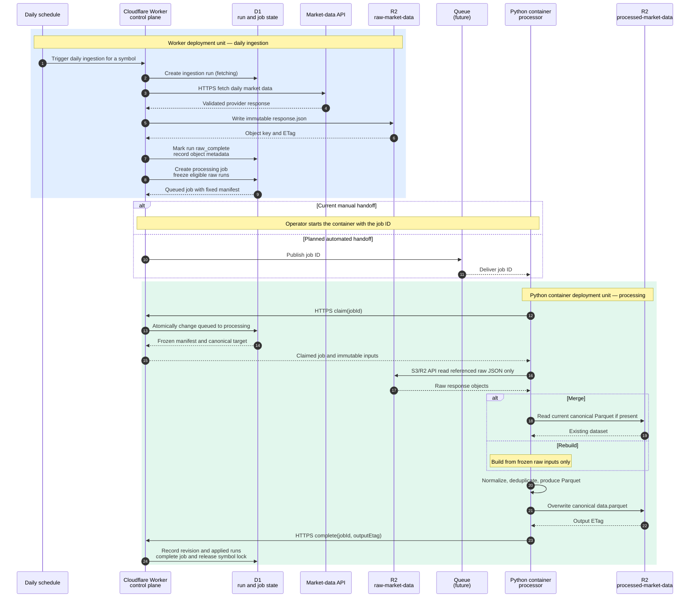

This diagram includes planned ingestion. Run-based ingestion is not yet wired
to cron or HTTP. Queue delivery is implemented through the Worker consumer,
which invokes the private container; the queue does not deliver directly to
Python. See [current architecture](MARKET_DATA_ARCHITECTURE.md) and
[next steps](NEXT_STEPS_SPEC.md) for the implementation boundary.

